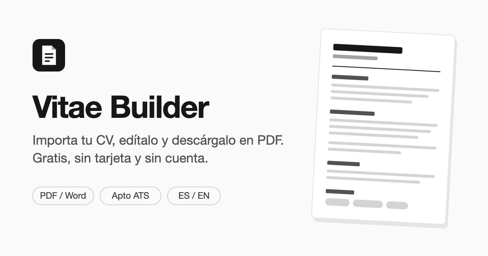

# Vitae Builder



Editor de currículums en el navegador. Importa tu CV en PDF o Word, edítalo por secciones, elige un
diseño (uno pensado para sistemas ATS), pásalo a inglés si lo necesitas y descárgalo en PDF.

**Gratis, sin tarjeta y sin cuenta.** Todo corre en tu navegador: tu CV no se sube a ningún servidor.

## Qué hace

- Importa PDF / DOCX y lo convierte en campos editables
- Secciones libres (texto, experiencia, etiquetas) que se reordenan arrastrando
- Dos diseños: **Minimal** (blanco y negro) y **Classic**
- Modo ATS: oculta la foto e imágenes para que los filtros automáticos lean bien el CV
- Versión en español e inglés, independientes entre sí
- Colores para títulos y subtítulos, foto opcional
- Exporta a PDF con la impresión del navegador

## Stack

React + TanStack Start, Tailwind, `pdfjs-dist` y `mammoth` para leer PDF y Word. Los CVs se guardan
en el `localStorage` del navegador. Desplegado en Netlify, sin base de datos ni cuentas de usuario.

## Correr en local

```bash
npm install
npm run dev
```

Para compartirlo desde tu máquina con ngrok, ver [docs/local-ngrok.md](docs/local-ngrok.md).
